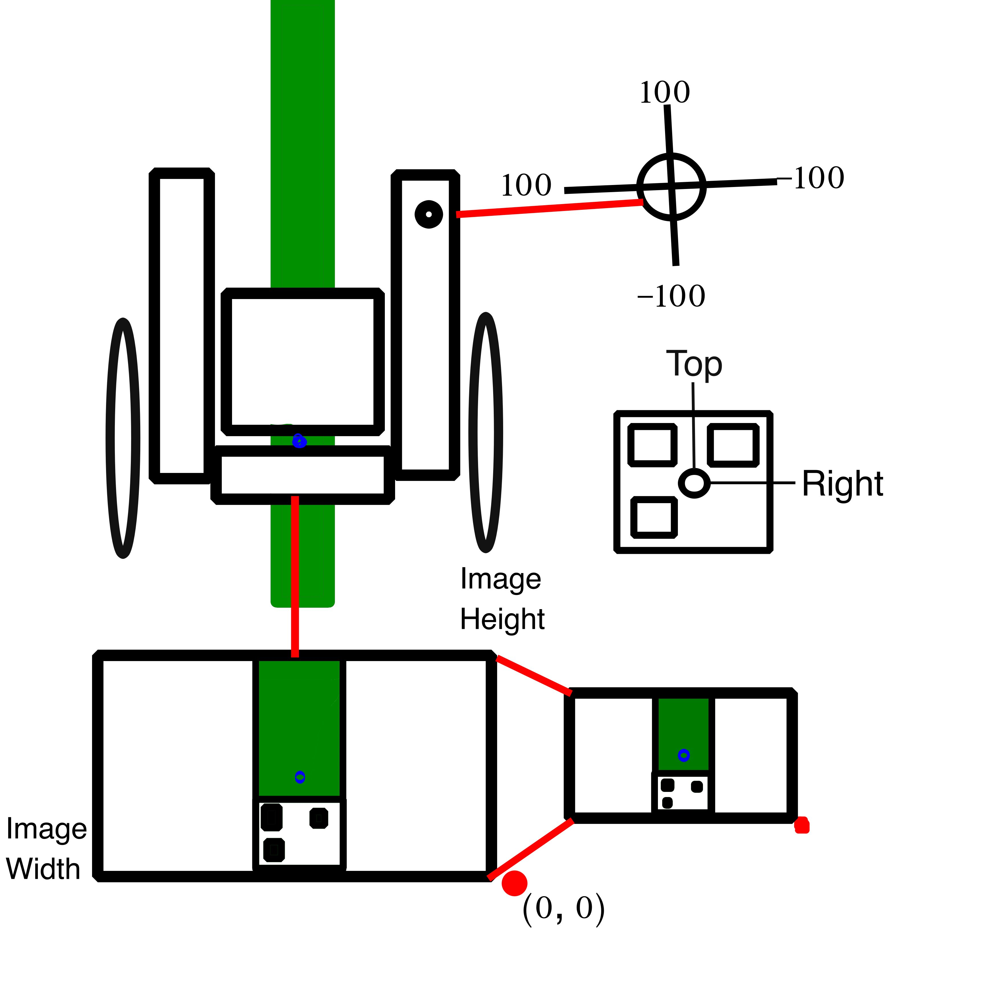
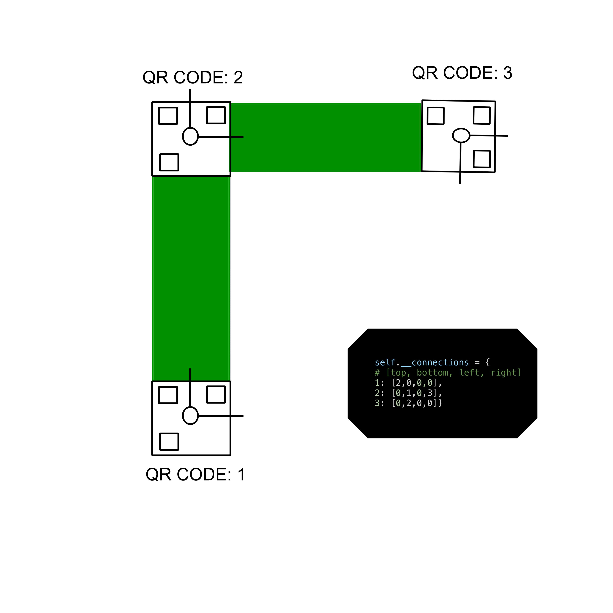

# Coordinate Frames 
Our platform makes a lot of assumptions when interpreting information and making action decisions. Most importantly those are the coordinates frames in order to understand if the chair is moving to the right or the left of the wheelchair and we have to have some idea of which pixels are associated with the right or the left of the wheelchair. Similarly we need to know if setting the angular component of our controller to positive 100 means move right or move left.

Line estimation works by sampling the
In order to create maps we assume that every junction is a simple cross. Or selves with respect to this QR code we need a regular system to describe the rotation
