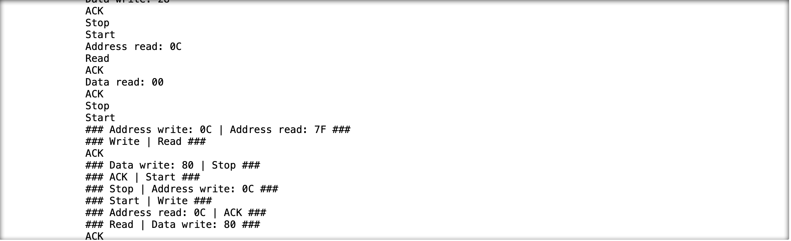
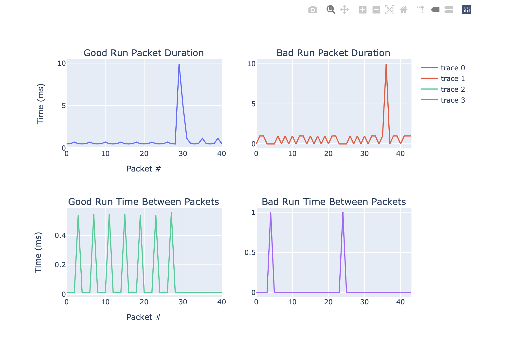
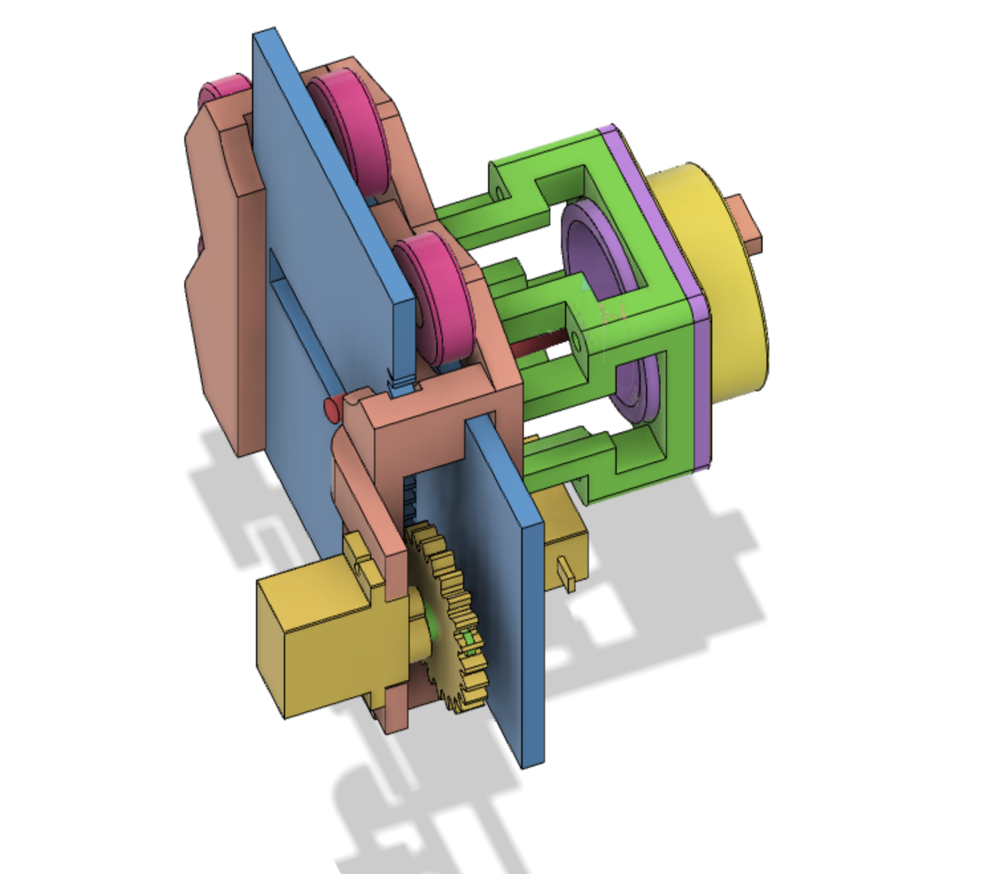
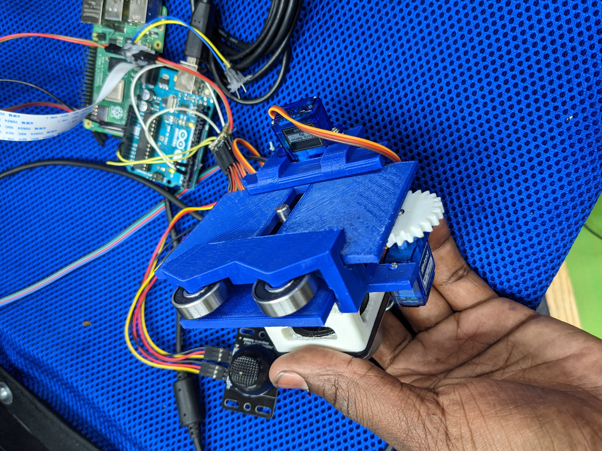

# Jul 10th - Jul 14th 2021 Wheelchair Update

by: Nile Walker

Just like in the last update the focus has been electronic control of the wheelchair. I've also taking steps to create demos and some tests to demonstrate the basic capabilities of the wheelchair.
<div align="center">

## **Software**

### **Remote Control**

To better facilitate remote control the option to connect a joystick to the host computer has been added. When moved the stick will override auto control and drive to chair. Also destinations can now be set by pressing the numpad button coressponding to the id of the intended destination.

### **Autonomy**

#### **Testing** 

I've added files matching the ```test.*.py``` pattern to the repo.

* The "following" file will wait until it sees a QR code and then drives forward following the line until the second code is seen.
The wheelchair was successfully able to follow a line of about 16 feet until it ran out of room but the reliability of this is limited due to responsiveness issues I'll go over later.
* The "facing" file will track a single QR code and attempt to maintain the rotation of the wheelchair with respect to the QR code that is being moved by an attached stick. This one works consistently but is harmed by the responsiveness issues mentioned above.

#### **The Responsiveness Issues**

Cameras have a limited FOV and some trade-offs needed to be made. As far as I currently understand it when capturing video frames very quickly the camera will limit the actual portion of the sensor that it uses. This severely limits the FOV and hence the amount of room for error the wheelchair even at its slowest speed.  

And two partial solutions to this problem would be to mount the camera higher up on the wheelchair and taking full images rather than a whole videostream.


I added a wooden bar from Home Depot to the rear of the wheelchair in order to mount the camera slightly higher and more towards the center of the two rotating wheels.

This improved FOV and since the camera is now centered with the point at which the wheelchair rotates I can tell the software to keep the QR at the center of the frame when rotating and its just generally smoother than previous methods.


Switching to just taking images didn't work at all though. Understandably the process is slower than just taking a video but as the profile or above shows it takes a whole .39 seconds to capture and store into arrays the necessary frames to navigate. Which is in the best of cases around 2 frames per second.

I'm currently using the picamera python module And I know from reading the documentation and specs available on the pi camera V2 that taking full FOV the video at a high enough resolution to do QR detection is possible but I've yet to successfully do it. I'm hopeful that this is an easy problem once I get into it but currently this is my most important blocker.

### **Networking**

For this update I switched from PAHO-MQTT to a simple UDP socket for talking to the wheelchair remotely while it doesn't change the structure of the software but it bought significant performance improvements so I felt it worth mentioning.

### **Joystick Analysis**

|                                        |                                     |
| -------------------------------------- | ----------------------------------- |
|  |  |

Then after using a python script to analyze the actual joysticks (good run) vs the Arduinos (bad run) communication with the wheelchair I was able to identify a discrepancy that I had been missing previously. After each time a "00" is read from the joystick during startup there is a very brief delay in between the detected packets.
<div align="center">

</div>
When looking at the actual output of the logic analyzer we can see that there is activity on the clock and data lines during this time. And after manual decode this info as I2C traffic I see the data is different each time "00" is read and is consistent across runs.

Since the data is consistent across runs the obvious solution would be to just send whatever the expected value is after each "00" is read but since the data are sent in a non-standard I2C way I'm not sure how one would go about manipulating the Arduino I2C library without building out somethings significantly lower level and out of my depth.

## **Hardware**

### **Digital Control**
|                                   |                                    |
| --------------------------------- | ---------------------------------- |
|  |  |

Since the previous controller was prone to drift and pure digital control is still mostly a pipe dream I designed this attachment that moves 2 perpendicular plates with slits in them such that the hole through them can be controlled.

Despite being significantly larger this design is much less sensitive to deviations in printing/assembly. Along with the X and Y axis being controlled independently so that those errors don't compound in any unintuive ways.

This controller works well and was used when running the tests I described earlier. Since it's all being runoff of the Arduino a separate joystick(mid left of the second image) can also be used to control the servos and overwrite input from the computer while on the chair itself.

### **Testing Equipment**


In order to make testing different configurations easier. I made a couple of the strips that have individual QR codes oriented all in the same way that I can connect to one another. These worked well and weren't typically disturbed by the wheelchair running over them like I thought they would be.
</div>