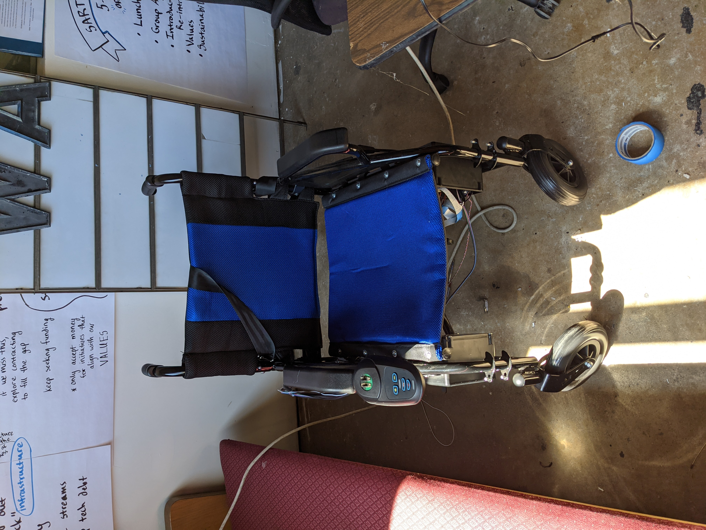
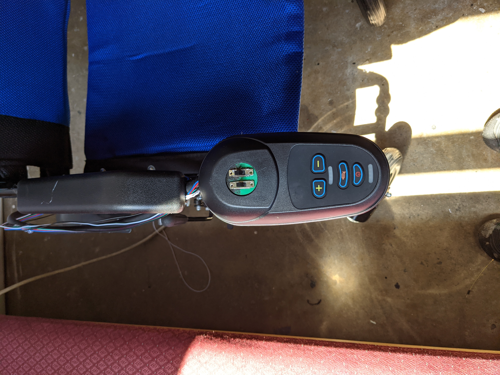
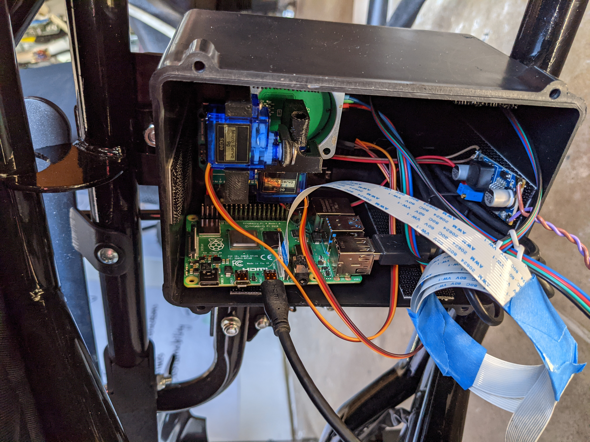

# Jun 11th - Jun 20th 2021

by: Nile Walker

This update took a while and was mostly focused on software updates, quality of life improvements, and the reinstallation of the controlling hardware.



## **Software**

### Map Building

The planning software is essentially the same except for the fact that instead of storing global position and rotation of the QR codes we simply store their relationship to one another. For example instead of storing that QR code 1 is at (x, y) position (1, 1) and QR code 2 is that position (1, 3) rotated at 90°, We now store that QR code 1's top edge is connected to QR code 2's right edge.
``` python
class QrMap():
    def __init__(self):
        self.__connections = {
            # [top, bottom, left, right]
            1: [0,3,0,0], 
            2: [0,3,0,0], 
            3: [4,2,0,1], 
            4: [3,0,0,0]
        }
```
This information is sufficient to determine what type of turns we need to make an order to traverse the map and better exploits the benefits of using a guiding line between all markers.

### Software Control

While the servo method has proved reliable enough, I still feel as though pursuing software based control is the logical next step as it allows us to give manual control to the rider without having a to build our own joystick into the wheelchair. There hasn't been any progress on that front so far nor has there been any real focus, but I'm waiting on a logic analyzer to come in and hopefully that will allow me to more clearly understand whats going on between the sensor and wheelchair.

## **Hardware**

### **Power Switch**



Instead of connecting directly to the wheelchair I added a simple switch that allows us to shut off the pi/arduino electronics without disconnecting the wheelchair battery.

### **Emergency Stop**

I also added an additional switch that will separate the ground for the sensor from the wheelchairs mainboard causing it to stop immediately. This is in case the raspberry pi shut down loses power or generally malfunctions we can more quickly disable the wheelchair since turning it off the normal way requires holding the power button down.

### **Mounting**

I instead of relying on gluing components into the battery box I added some Velcro and I'm just velcroing the components in so that they can be removed or adjusted as necessary.



## **Usability**

I've also had a documentation to the github. Describing how to create a new QR code map and how to run the navigation software. It's in its early stages and will be adjusted as other features are added but should be enough for the incoming team of developers to test the platform on their own.