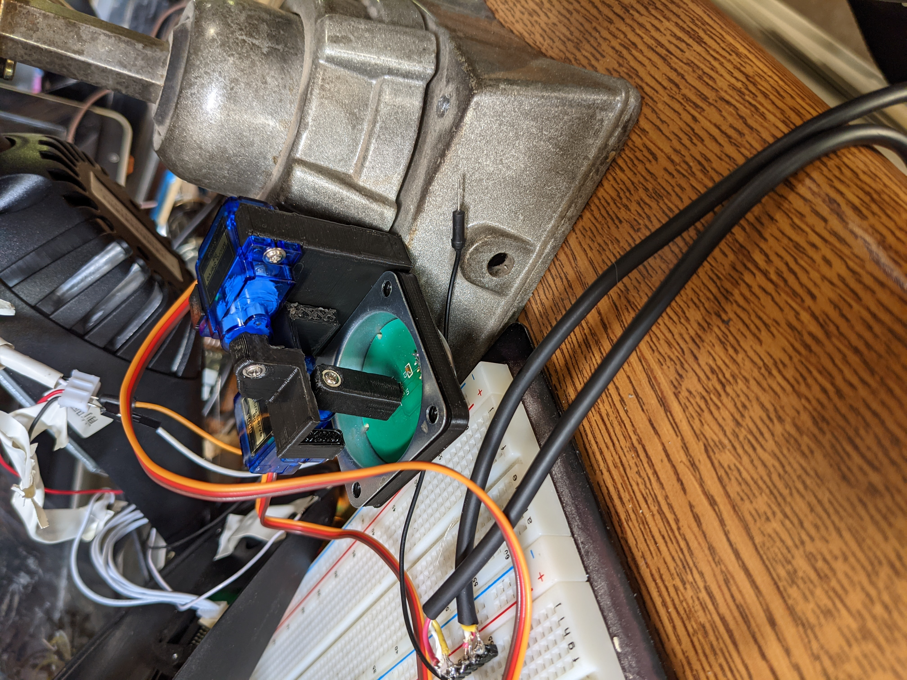

# May 4th - May 6th 2021 Wheelchair Update

by: Nile Walker

Just like in the last update the focus has been electronic control of the wheelchair. 

## **Software**

### **I2C Hall Sensor**
Not much is changed here, I still can't get the wheelchair to accept the arduino as a viable sensor replacement. I tried putting the arduino and the sensor onto the bus with the same address and only sending commands to the wheelchair from the Arduino once I disconnected the sensor and it still fails then also.
There is some unique data that's communicated only where the wheelchair starts up and figuring out what it's doing or replaying it from the arduino might provide additional information but I haven't gotten to that stage yet. Since I'm not confident that I'm actually reading that data right yet and I've been a bit spread out since I'm graduating this week.
``` bash
19:56:44.920 -> i2c sniffer by rricharz
19:56:44.920 -> Acquiring data
19:56:47.364 -> Analyzing data, number of transitions = 2966
19:56:47.364 -> i2c bus activity: * means ACQ = 1 (not ok)
19:56:47.364 -> Dev=0C W Data=D0 
19:56:47.364 -> Dev=0C R Data=01 
19:56:47.364 -> Dev=0C W Data=80 
19:56:47.364 -> Dev=0C R Data=01 
19:56:47.364 -> Dev=0C W Data=50 14 
19:56:47.364 -> Dev=0C R Data=00 56*2B 88 
19:56:47.364 -> Dev=0C W Data=80 
19:56:47.364 -> Dev=0C R Data=01 
19:56:47.364 -> Dev=0C W Data=50 16 
19:56:47.364 -> Dev=0C R Data=00 42 21 48 
19:56:47.364 -> Dev=0C W Data=80 
19:56:47.364 -> Dev=0C R Data=01 
19:56:47.364 -> Dev=0C W Data=50 18 
19:56:47.364 -> Dev=0C R Data=00 42 20*48 
19:56:47.364 -> Dev=0C W Data=80 
19:56:47.364 -> Dev=0C R Data=01 
19:56:47.364 -> Dev=0C W Data=50 1A 
19:56:47.364 -> Dev=0C R Data=00 60 30 48 
19:56:47.364 -> Dev=0C W Data=80 
19:56:47.364 -> Dev=0C R Data=01 
19:56:47.397 -> Dev=0C W Data=50 1C 
19:56:47.397 -> Dev=0C R Data=00 60 30 48 
19:56:47.397 -> Dev=0C W Data=80 
19:56:47.397 -> Dev=0C R Data=01 
19:56:47.397 -> Dev=0C W Data=50 1E 
19:56:47.397 -> Dev=0C R Data=00 40 30*48 
19:56:47.397 -> Dev=0C W Data=80 
19:56:47.397 -> Dev=0C R Data=01 
19:56:47.397 -> Dev=0C W Data=50 20 
19:56:47.397 -> Dev=0C R Data=00 40 30 48 
19:56:47.397 -> Dev=0C W Data=F0 
19:56:47.397 -> Dev=0C R Data=04 00 40 50*
19:56:47.397 -> Dev=0C R*Data=FF 
19:56:47.397 -> Dev=0C W Data=60 40 2E 00 
19:56:47.397 -> Dev=0C R Data=01 
19:56:47.397 -> Dev=0C W Data=80 
19:56:47.397 -> Dev=0C R Data=01 
19:56:47.397 -> Dev=0C W Data=60 70*40 02 
19:56:47.397 -> Dev=0C R Data=01 
19:56:47.397 -> Dev=0C W Data=80 
19:56:47.397 -> Dev=0C R Data=01 
19:56:47.397 -> Dev=0C W Data=60 00*72*04 
19:56:47.397 -> Dev=0C R Data=01 
19:56:47.397 -> Dev=0C W Data=36 
19:56:47.397 -> Dev=0C R Data=21 
19:56:47.397 -> Dev=0C W Data=46 // Start normal repeating operations
```

## **Hardware**

### **Servo Joystick**
Since the software-based joystick is a little out of grasp for right now and I really want to get back to fine-tuning the autonomy stuff I decided to switch over to a more low tech automated control approach.



Just what it looks like the two servos move a small magnet above the sensor, similar to how the joystick would. This works well enough in that I can reliably move forward,backwards, turn right, and turn left at varying speeds.

The issue now is reliably stopping, the dead zone for the sensor is pretty small so tiny issues with the alignment or slipping will cause the chair to continually move at a very slow speed in a random direction and without any feedback from how the wheelchair the only real solution is a better designed part. 

So after with some tweaks to make the assembly less likely to slip and printing on lower speed settings. I think another improvement might just be to include some springs on either side of the  magnet so that it's pulled or pushed into the appropriate position like the normal joystick already does.

###  Notes:
≥
I'm pretty confident that those solutions will work but just as a note.
I'll give this maybe another 3 days and if I don't get something that's working to satisfactory level I think I'm just going to sideline electronic control for now and manually drive the wheelchair based on some sort of output from the computer planner. As long as we can reliably move, turn and stop I don't think that it's worth spending a bunch of time developing a jerry rigged electronic control system since actually tuning the software to work in a enjoyable way for the rider will be very dependent on the actual method of electronic control.