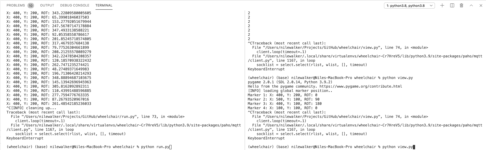

# April 13th - April 15th 2021 Wheelchair Update

by: Nile Walker

## **Software**

As of April 15, 2021 the autonomous wheelchair project has been moved into two programs



### **View** 
The view program communicates with the wheelchair over a network to send goals and update a simple visualization of the robots position and QR code positions


The QR code IDs, positions and rotations are stored in a text file as shown below and read on startup

``` txt
1, (400,200,0)
2, (500,100,90)
3, (400,100,180)
4, (100,100,0)
```

Changes in configuration are sent to the mobile platform also.

``` As of right now only global positions are stored but for real world planning some indication of which qr codes are connected by the guiding line will need to be stored also.```

### **Run**

The logic for the autonomous wheelchair has been separated into three critical components. (Detector, Planner, Driver). The reason for this was so that individual components could be tested and modified without significant change to the overall structure of the program.

#### **Detector**

The purpose of the detector is to interact with the external sensors in the wheelchair it reads from the camera and interacts with the distance sensors. Currently it just averages the position of color values within a certain range to find the guiding line but other approaches could be implemented if this doesn't work in actual testing.


For detecting QR code I'm using a modified version of the pyzbar module that will always output the position of a QR codes corners in the same order. This allows me to determine the rotation of the QR code in the camera frame and update the rotation of the robot in the map/planning frame.

#### **Planner**

The purpose of the planner is to respond to the various sensor readings and output a command to be run on on the chair. Some of the logic here has been implemented but it can't really be tested until we have full control over the wheelchair. As of right now the most complicated bit of logic is that the planner will default to using the position of the QR code as a guide rather than relying on the detection of the guiding line if one is visible. This is because the QR codes are always assumed to be within the black lines and junctions between different guiding lines complicate the line following algoritm so in these cases we just ignore the line all together.

#### **Driver**

The purpose of the driver is to interact with the controls of the wheelchair. The current plan is to use an Arduino Uno to intercept the I2C commands that would usually be coming from the joystick itself. This sort of set up not only allows us to monitor for manual input on the joystick but to send digital commands to the wheelchair without interfering with any of its other components.

## **Hardware**

### **Guide**

The guiding line consist of two large strips of black tape with two strips of green in the center. While the initial plan was to use black and white tape to identify the guiding line, I noticed that at least on Morgan's glossy floors detection became significantly less reliable and was worried that in the future that noise would become an issue so switched to a more distinct color.


Each QR code stores only one number which is used as an ID to determine the position of the chair when it is seen. 

### **Joystick**

The joystick was previously assumed to be an analog joystick but upon further testing that's not the case. The joystick uses a 2 axis hall sensor IC and communicates to the wheelchair using I2C. Both the Arduino and the raspberry pi are 5V devices so we have ordered some 3.3 to 5 V interfaces and will keep working once those arrive.

If the joystick is ever disconnected from the wheelchair it will require a full restart of the device. It's for this reason that atleast for now I'm deciding to go with the Arduino for instead of just the raspberry pi as the start of time for the pi might prevent it from passing whatever startup checks the wheelchair has in place but this decision is likely to change when more information becomes available.

### **Camera**

The camera is held on with a simple 3-D printed mount that clamps on to the lower frame of the wheelchair. This keeps the wheel chair foldable while positioning the camera so that it faces straight down towards the ground.


Two 5/16 2 inch hex bolts are used to hold the parts together. You could probably get away with one but I put two.